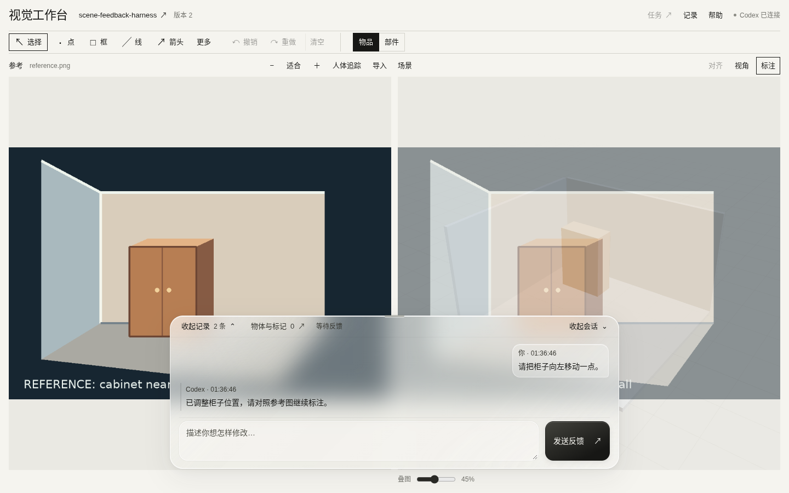

**语言 / Languages:** [简体中文](README.md) · [English](README.en.md) · **日本語** · [한국어](README.ko.md) · [Русский](README.ru.md)

[更新履歴（中国語）](CHANGELOG.md) · [保守ルール（中国語）](CONTRIBUTING.md)

# Codex ビジュアル再構築ワークベンチ

標準モードでは、参照画像と現在の 3D シーンに印を付け、ひとつの指示文を書いて「送信」をクリックします。ワークベンチは文章、元画像、注釈付き画像、シーンのスナップショットを、**ワークベンチが管理する同じ Codex スレッドのユーザーメッセージ**として送ります。Codex がプロジェクトを編集して GLB を公開すると、結果がこのページに戻ります。もう一度読み取らせるためにターミナルで操作する必要はありません。既存の Codex デスクトップタスクでも、後述する外部 MCP モードで同じ確認画面を使用できます。



## 動作の流れ

```text
ブラウザー：参照画像 + 3D シーン + 注釈 + 文章
                    │ ユーザーが「送信」をクリック
                    ▼
           ローカル Workspace Gateway
                    │ 実際の画像入力と実行イベント
                    ▼
     Codex App Server：同じプロジェクト、同じスレッド
                    │ ソース編集、GLB の書き出し、MCP ツールの呼び出し
                    ▼
             ワークベンチがシーンを更新
```

標準モードでは、Gateway がこのプロジェクトの Codex スレッドを一つ永続化します。`codex app-server` を stdio 経由で起動し、画像を `localImage` 入力項目として送ります。このモードは、すでに開いている別の Codex デスクトップやターミナルのセッションにメッセージを注入しません。MCP はコンテキストの取得、ユーザーへの確認依頼、シーンの公開に使用します。**Web ページの送信ボタンがユーザーターンを直接開始します。**

この画面は、人が問題を指し示すためのものです。再構築アルゴリズムを定めたり、座標や幾何拘束の入力を求めたりしません。Codex はプロジェクトで利用できる既存のモデリング、再構築、編集ツールを使えます。

## 画面の配置と操作の入口

背景は暖かみのある白、操作部は黒とグレーです。広い画面では参照画像とシーンを左右に並べ、上に横型ツールバー、下に共通のプロンプト欄を置いています。タスク、実行記録、参照のパネルは必要なときに開きます。

| 操作部 | 用途 |
| --- | --- |
| ツールバー | `选择`（選択）、点、矩形、線、矢印。`更多`（その他）に文字、自由描画、任意の対応番号があり、`物品 / 部件` で物品／部品の選択を切り替えます |
| 上部の現在のタスク名 | タスクパネルを開き、宛先を切り替えるか、名前・モデル・思考強度・権限を選んで新規作成します |
| 上部の `记录` | 実行状況、承認、フィードバックのキュー、メッセージ履歴。通常は閉じており、新しい承認や対応が必要な失敗・送達不明の項目で一度自動的に開きます |
| 下部の `物体与标记` | 物体と印の参照一覧。`引用` を押すとプロンプトのカーソル位置に挿入し、パネルを閉じて入力欄に戻ります |
| 参照画像側の `导入` | 参照画像、動画、画像連番の読み込みと FPS の設定 |
| タイムラインの `选项` | フィードバック範囲、時間区間、GLB のアニメーション動作の選択 |

下部の送信ボタンは通常 `发送反馈`（フィードバックを送信）、タスク実行中は `加入下一轮`（次のターンへ追加）です。古いシーンのスナップショットを表示していると、重ね合わせの操作部の下に `标注 v13 · 查看最新 v15 ↗` のようなボタンが出ます。押すと最新のライブシーンを表示し、古い画像と印は保持します。

## ページでできること

- 左側で参照画像を切り替え、拡大・縮小・移動できます。右側では GLB シーンを回転・拡大縮小し、ノードを選択できます。
- 物品単位と部品単位の選択を切り替えられます。物品単位では GLB の最上位のシーンノード（現在のアセットでは物品一つ全体）を、部品単位ではクリックした詳細な名前付きノードを選びます。基本図形のシーンオブジェクトは常に全体を選択します。どちらの単位も同じ指示文で参照できます。
- 両側に点、矩形、線、矢印、フリーハンドの線、文字を描けます。対応する印には同じ番号を付けられます。まだ存在しない物体は参照画像だけに印を付けられます。
- ツールバーの `撤销 / 重做`（元に戻す / やり直す）で、印の追加、削除、一括消去を取り消したり復元したりできます。ショートカットは `Ctrl/Cmd + Z` と `Ctrl/Cmd + Shift + Z` です。`清空`（すべて消去）は全ての印、固定したスクリーンショット、保存済みの動的時刻を一度に消去してライブ 3D シーンに戻り、取り消しもできます。指示文と参照画像は保持します。指示文の入力欄では通常のテキストの取り消しが使えます。注釈の履歴は現在のページ内だけで保持し、再読み込みするとリセットされます。
- Codex への指示はひとつの自由記述欄に書きます。文中にカーソルを置き、物体、選択した GLB ノード、または印の横にある「引用」（参照を挿入）を押すと、同じ指示文に複数の参照を挿入できます。形式は `[[object:ID]]`、`[[node:MODEL_ID:0/2]]`、`[[annotation:ID]]` です。たとえば棚を画像の印へ動かし、上端を別の線に合わせるよう、ひとつの指示文で伝えて送信できます。まだモデル化されていない物も参照画像に印を付けて引用できます。シーンで一度にハイライトできる選択オブジェクトは 1 つです。 `物体与标记`（物体と印）パネルの `引用全部标记`（すべての印を参照）を押すと、保存済みの動的時刻を含む未参照の印をカーソル位置にまとめて挿入します。既存の参照は重複せず、パネルが閉じて指示文の入力を続けられます。
- 描画ツールを選び、右側で直接クリックまたはドラッグすると注釈を付けられます。**その時点のスクリーンショット、カメラ、選択オブジェクト、シーンのリビジョン**を自動で保存します。`标注`（注釈）を押して先に表示を固定することもできます。静的シーンでは同じ視点・リビジョンのまま描き続ける場合、元のスクリーンショットを使います。印のある静的画像を置き換える前には、古いシーン側の印を消去するか確認します。キャンセルすると変更せず、確認後の置き換えも元に戻せます。動的シーンは保存した時刻ごとに画像を保持します。ライブの 3D ビューを回転しても、古い印が別の物体へ移動することはありません。新しいシーンが公開されても、注釈作業中のスナップショットは上書きされません。
- 印の参照を挿入するか、`选择`（選択）または `返回 3D` を押すと、ライブ 3D シーンで再び選択できます。固定したスクリーンショットと既存の印は残り、`标注截图`（注釈画像）で保存時の視点に戻り、その画像への注釈を再開できます。シーンの矢印などは元の画像に結び付けて保存します。ライブビューを回転したりページを再読み込みしたりしても、その画像は上書きしません。送信時には印のある元の画像と元のカメラを渡し、回転後の画面に古い矢印を重ねることはありません。
- 送信時に、変更されないフィードバック一式を保存します。ユーザーの原文、元の参照画像と注釈付き画像、注釈のないシーンと注釈付きシーンのスクリーンショット、選択ノード、カメラ、シーンのリビジョンが含まれます。印は人からのヒントであり、元画像は別に保持されます。
- サーバーが HTTP 経由でフィードバックを保存したと確認できると、その回の指示文、すべての印、固定した画像、保存済みの動的時刻、物体・ノードの選択と参照を自動で消去し、ライブ 3D に戻って空の下書きを保存します。Codex への配信が待機中または不確定でも、次の回を開始します。送信済みフィードバックの証拠、参照画像、現在のアニメーション時刻は保持され、新しいシーン結果が届いても次の回で書き始めた下書きは残ります。HTTP 保存に失敗した場合や保存結果を確認できない場合は、修正して再試行できるようローカルの下書きと送信待ち記録を保持します。
- Codex の実行中に送信した新しいフィードバックは、次のターンのキューに入ります。待機中にシーンが更新されても、保存済みのフィードバックは自動で配信されます。モデルには元のスクリーンショットのリビジョンと配信時の現在のリビジョンを伝え、古い画像に対する指示として解釈できるようにします。送信時点で画像がすでに古くても、送信ボタンを押すと追加の確認なしで送信します。モデルには画像の実際のリビジョンを伝えます。承認依頼と停止操作もページで扱います。
- 再読み込みするとプロジェクト、スレッド、下書き、元の画像を復元します。古いスクリーンショットが自動で新しいリビジョンになることはありません。「最新を表示」はライブシーンに切り替えるだけで、以前の画像は保持します。現在の結果に改めて注釈を付けるには `清空`（すべて消去）の後で描き直してください。誤って消した場合は元に戻せます。スクリーンショットや保存済みフィードバックのリビジョンは書き換えません。

現在、シーン入力には自己完結型の `.glb` ファイルを使用します。公開時の検証では、ジオメトリとテクスチャのリソースが GLB の BIN チャンクに埋め込まれている必要があります。外部 URI と data URI はどちらも拒否されます。data URI でも自己完結にはできますが、このバージョンでは BIN への埋め込みだけを受け付けます。初期シーンがなくても、参照画像だけを送信できます。

## シーンの切り替えと新しい再構築タスク

上部のシーン名をクリックすると一覧が開きます。既存のシーンに戻るほか、名前、モデル、思考レベル、権限を指定して、**新しいシーンと Codex Desktop タスク**を作成できます。参照画像や動画を読み込み、入力欄から再構築の指示を送って開始します。最初の GLB は不要です。

参照素材、カメラ、動的ビュー、再構築結果、フィードバック履歴、送信先タスクはシーンごとに保存されます。切り替える前に下書きを保存し、戻ると復元します。複数タブで別々のシーンを開けます。以前のタスクと待機中のフィードバックは元のシーンで続行します。送信や読み込みの途中では、その操作が終わってから切り替えます。

新しい作業ディレクトリはサービスのデータディレクトリ内の `projects/<project_id>/workspace` に作成され、同じ LAN アドレスとポートを使います。新しいタスクの MCP はそのディレクトリに接続し、既存の MCP は元のシーンに接続し続けます。タスク作成の結果が不明、または接続に失敗した場合も、シーンは一覧に残り復旧できます。同じ作成リクエストの再送でタスクが重複作成されることはありません。

タスクの新規作成には Codex Desktop への接続（`--external-review --shared-thread-id`）が必要です。ブラウザは LAN 内の別端末でも使えます。従来のタスクパネルは、**現在のシーン内**のタスク切り替えと作成に使います。

## 参照カメラの視点に合わせる

カメラ情報のある参照画像を選ぶと、3D ビューはその撮影位置に自動で切り替わります。重ね合わせは初めから表示され、透明度を直接調整できます（0% で非表示）。手動で回転した後は `对齐`（視点を合わせる）を押すと元のカメラに戻れます。歪み補正済みの画像がある場合は、その画像をピンホール投影に合わせた重ね合わせに使います。元画像は表示とフィードバック用に別途保持します。カメラ情報のない画像は従来どおり手動で比較できます。内部パラメータが近似値の場合は、画像の端にずれが残ることがあります。

各画像のカメラ情報には、GLB のワールド座標における行優先の 4×4 行列 `camera_to_world` と、画像のピクセル単位の `intrinsics`（`width`、`height`、`fx`、`fy`、`cx`、`cy`）を含めます。既存画像には、保護された `POST /api/workspace/reference-cameras` API で `reference_id`、`camera`、必要に応じて歪み補正画像の `alignment_image_data_url` を送ります。非公開のデータディレクトリに置く `reference_cameras.json` は、今後取り込む画像の名前の先頭部分でカメラを照合します（[例](examples/reference_cameras.example.json)）。既存画像にも適用するには、同じ API に `{"apply_manifest":true}` を送ります。カメラと公開する GLB は同じワールド座標系にしてください。

## 動的シーン：複数カメラの共通タイムラインとフィードバック

同じクリップの複数の参照カメラ（画像連番や動画）を、アニメーション付き GLB と同じタイムラインで確認できます。再生・一時停止・シーク・前後のサンプルフレームへの移動で、参照画像と 3D アニメーションが同時に更新されます。従来の静止画像と静的 GLB も引き続き使えます。GLB はノードの移動・回転・スケール、スキニング、固定トポロジーの morph アニメーションに対応します。トポロジーが変わるメッシュキャッシュ、流体、リアルタイム物理シミュレーションにはまだ対応していません。

- 参照カメラを切り替えても現在の時刻は保持され、新しいカメラの現在フレームの姿勢に自動で合わせます。カメラ情報がなければ手動で比較できます。各カメラの `time_sec` は同じ時間原点を使います。1 回の送信で複数カメラの印を参照でき、各印はカメラ名、`view_id`、フレーム番号・時刻、元画像とカメラ姿勢を保持します。
- 参照サムネイルのカメラ校正が動的カメラの 1 つに一意に対応する場合、`同步`（同期）と表示します。クリックするとその動的カメラに切り替わり、タイムラインを動かしてもそのカメラを使い続けます。対応しない場合や複数に対応する場合は静的な参照画像のままです。左側のカメラ選択欄で動的カメラを直接選べます。
- 一時停止中は静止画像のサムネイルを確認できます。再生、シーク、前後のフレームへの移動で動的な参照画像列に自動で戻り、新しく公開された画像列でも同期を再開します。保存済みの印は元のフレームに保持します。
- 注釈を描き始めると再生を一時停止し、その時刻、参照フレーム、カメラ、シーンのリビジョンを記録します。全カメラの合計で最大 8 件の時刻スナップショットを保持し、その時刻に戻って確認や注釈を続けられます。
- 1 つのプロンプトで複数のカメラと時刻の注釈や物体を参照できます。タイムラインの `选项` メニューで、フィードバックの対象を `所标帧`（印を付けたフレーム）、時間区間、クリップ全体から選びます。区間は修正してほしい範囲を表し、描いた線を軌跡や幾何制約として扱うものではありません。
- 動的な印を個別または一括で参照すると、指示文に `片段第 N 帧 · T s`（クリップの N 番目のフレーム・T 秒）を表示します。参照にはカメラ名も付き、構造化フィードバックに `view_id` を保持します。番号はそのカメラで読み込み・抽出した画像列内で 1 から始まり、保存した印の番号と時刻はタイムラインを動かしても変わりません。モデルに送る `frame_index` は保存した参照画像 ID とそのカメラの画像列の順序から 0 始まりで計算します。静止参照画像や GLB のみの印には時刻だけを付けます。
- 注釈は所属するカメラの対応するフレームで表示されます。送信内容には、選んだ時刻の元画像・注釈付き画像・シーンスナップショットと、時刻、カメラ、物体参照、シーンのリビジョンが含まれます。動画全体を全フレーム送信することはありません。
- 各参照フレームにカメラ姿勢を付けられ、フレームを選ぶとそのカメラに合わせます。GLB を更新しても再生位置は保持され、シークで `scene_revision` が増えることはありません。
- GLB の書き出し時に、ノードの `extras` に `semantic_id` または `stable_id` を保持すると、フレームや再書き出しをまたいだ物体の識別に役立ちます。ノードパスは同じリビジョン内での位置指定に限られます。名前やパスは再書き出しで変わる場合があり、自動追跡を行うものではありません。

参照画像側の `导入` メニューで複数の動画を選ぶと、それぞれを別のカメラとして追加し、サーバーでフレームを抽出します。画像連番は 1 回の読み込みで 1 カメラとなり、指定 FPS を使います。ブラウザーからの読み込みはカメラを追加し、既存のカメラと印を保持します。動画にはサービスホストで `ffmpeg` と `ffprobe` が必要で、画像連番には不要です。動画の抽出は共通の時間グリッドで行い、既定値は 10 FPS です。最大 8 カメラ、各カメラ 600 フレームです。上限を超える場合は FPS を下げるか、必要な区間を先に切り出してください。

Codex からも `workspace_set_reference_clip(manifest_path=None, video_path=None, fps=None, camera_manifest_path=None, clear=False, append_view=False, view_name=None)` でプロジェクト内の素材を読み込めます。`manifest_path` と `video_path` はどちらか一方を指定します。`append_view=True` はカメラを追加し、既存の素材と印を保持します。`view_name` で新しいカメラに名前を付けられます。既定の `append_view=False` は従来の API と同じ置き換え動作で、既存のカメラ全体を置き換えます。旧フレームを参照するフィードバックは置き換える前に送信してください。`clear=True` はシーンのリビジョンを変えずに参照カメラ全体を削除します。

画像連番はマニフェストの `fps`（省略時 30）を使い、ツール引数の `fps` は動画だけに適用されます（既定値 10）。各フレームの `time_sec` を省略すると、0 始まりのフレーム番号をマニフェストの FPS で割った時刻を使います。ファイル名から FPS を推測しません。FPS は 0.1–120 です。容量はカメラごとに検証され、ブラウザーの動画ファイルまたは画像連番の画像合計は 40 MiB、プロジェクト内の動画ファイル・抽出画像合計・画像連番の画像合計は 250 MiB が上限です。入力ファイルはすべてプロジェクト内に置きます。

既存の単一クリップは主カメラとして引き続き使え、元の `clip_id`、フレーム、印を保持します。`reference_clip` の最上位フィールドは主カメラを表し、`views` 配列は追加カメラだけを保存します。追加しても主 `clip_id` は変わらず、各カメラ自身の `clip_id` を `view_id` として使います。この機能は複数カメラの確認とフィードバックを整理し、形状の修正は同じ Codex タスクが行います。

画像連番のマニフェスト例（入力ファイルはすべて現在のプロジェクト内に置きます）：

```json
{
  "name": "assembly-review",
  "fps": 10,
  "frames": [
    {"path": "/absolute/path/to/project/frames/0000.png", "time_sec": 0.0},
    {"path": "/absolute/path/to/project/frames/0001.png", "time_sec": 0.1}
  ]
}
```

複数カメラの一括マニフェストは [reference_multiview.example.json](examples/reference_multiview.example.json) を参照してください。最上位に `name` を指定でき、`views` の各項目にはカメラの `name`、`fps`、`duration_sec` と、`frames`・`manifest_path`・`video_path` のいずれか 1 つを指定します。フレームは `path` と任意の `time_sec`、`name`、`camera` を持てます。動画には `camera_manifest_path` を付けられます。相対パスは外側のマニフェストを基準とし、入れ子のマニフェスト内のフレームはそのファイル自身を基準とします。最初の項目が主カメラとなり、`append_view=True` では一括で既存グループに追加します。例のカメラ値は実際のキャリブレーションに置き換えてください。

カメラの整合を保つには、マニフェスト / MCP で読み込み、画像連番の各フレームに前述の `camera` を付けてください。ブラウザーで画像や動画のファイルだけを読み込んでも、カメラ姿勢は自動取得されません。動画には別の `camera_manifest_path` を指定できます。固定カメラのマニフェスト例です（値は実際のキャリブレーションに置き換えてください）：

```json
{
  "camera": {
    "camera_to_world": [[1,0,0,0],[0,1,0,0],[0,0,1,2],[0,0,0,1]],
    "intrinsics": {"width":1920,"height":1080,"fx":1200,"fy":1200,"cx":960,"cy":540}
  }
}
```

移動カメラでは `{"frames":[{"time_sec":0.0,"camera":…},…]}` で動画のサンプル時刻をカバーします。この版では近いサンプルを対応させ、カメラの補間や推定は行いません。動画の内部パラメーターは抽出画像のサイズに合わせて縮尺を調整します。画像連番の内部パラメーターは対応する画像のサイズと一致させてください。

マニフェストを読み込むか、指定 FPS で動画を抽出します：

```text
workspace_set_reference_clip(manifest_path="/absolute/path/to/project/clip.json")
workspace_set_reference_clip(manifest_path="/absolute/path/to/project/reference_multiview.json", append_view=True)
workspace_set_reference_clip(video_path="/absolute/path/to/project/camera_B.mp4", fps=10, camera_manifest_path="/absolute/path/to/project/video-cameras.json", append_view=True, view_name="camera_B")
```

## クイックスタート：部屋とキャビネット

ブラウザーのボタン表示は中国語です。`标注` は注釈、`返回 3D` はライブの選択画面へ戻る操作、`发送反馈` はフィードバックの送信です。

Python 3.11 以降、WebGL 対応ブラウザー、ログイン済みの **`codex-cli 0.156.1`** が必要です。App Server のリクエストとレスポンスの形式は、このバージョンから生成した JSON Schema と照合済みです。ほかのバージョンでは、互換性のないフィールドを黙って使わないよう、明示的なエラーを出します。

クローンしたリポジトリのルートで以下を実行します。

```bash
python3 -m venv .venv
.venv/bin/python -m pip install -r backend/requirements.txt
codex --version
.venv/bin/python examples/room_demo/seed_demo.py
.venv/bin/python backend/server.py --project-dir "$PWD" --data-dir "$PWD/examples/room_demo/output/data"
```

Gateway は、このプロジェクトの Codex スレッドにワークベンチの `scene_feedback` MCP ツールを自動設定します。`codex mcp add` を手動で実行する必要はありません。Gateway はポート、データディレクトリ、プロジェクトディレクトリをそのスレッドに渡し、別のプロジェクトやグローバル MCP 設定が誤ったワークベンチを参照することを防ぎます。

<http://127.0.0.1:18765/> を開きます。左側に目標のイメージ図、右側に初期状態の部屋の GLB が表示されます。キャビネットを選び、画像上で目標位置を示し、「キャビネットを左の壁にもっと近づけ、左の画像に合わせてください」と入力して「送信」をクリックします。デモの元パラメーターは [`examples/room_demo/scene.json`](examples/room_demo/scene.json) にあります。[`build_scene.py`](examples/room_demo/build_scene.py) はそのパラメーターから GLB を生成します。Codex が `workspace_publish_scene` を呼び出すと、結果がページに表示されます。`seed_demo.py` は独立した `examples/room_demo/output/data` を使用するため、通常のワークスペースのデータを上書きしません。

自分のプロジェクトでは、次のコマンドを使用します。

```bash
.venv/bin/python backend/server.py --project-dir "/absolute/path/to/your/project" --data-dir "/absolute/path/to/private/workspace-data"
```

参照画像はブラウザーから追加します。Codex にプロジェクトのソースファイルから自己完結型の GLB を構築または書き出させ、MCP 経由で公開します。プロジェクトのディレクトリとスレッド ID はデータディレクトリに保存され、再起動後も同じスレッドを復元できます。一つのデータディレクトリは一つのプロジェクトに紐付き、黙って別のプロジェクトに切り替わることはありません。

## 既存の Codex デスクトップタスクから確認する（外部 MCP モード）

既存の Codex デスクトップタスクには、二つの方法でフィードバックを届けられます。`--external-review` だけを使う場合、そのタスクが `request_visual_feedback` を呼びます。ツールは標準でブラウザーからの送信を待ちます。**サーバーに画面がなく、ブラウザーを自動で開けない場合も待機します**。「送信」をクリックすると、待機中の元のタスクに文章と画像が MCP ツールの結果として戻ります。`wait_for_submit=False` を明示すると、ツールは URL、`session_id`、`next_cursor` をすぐに返します。その場合、元のタスクが `wait_visual_feedback(session_id, cursor=next_cursor)` を呼ぶ必要があります。待機中の呼び出しが終了またはタイムアウトしていれば、フィードバックは保存されますが、アイドル状態のタスクは自動的に再開しません。元のタスクから読み直すか、後述するタスクの紐付けを使ってください。`get_visual_feedback` で送信済みの内容を再取得できます。

上記の依存関係を先にインストールしてください。ターミナルで絶対パスを指定してグローバル MCP サーバーを登録し、独立した確認用サービスを起動します。

```bash
REPO=/absolute/path/to/scene_feedback_harness
PROJECT=/absolute/path/to/your/existing/project
DATA=/absolute/path/to/private/external-review-data
codex mcp add scene_feedback_external \
  --env SCENE_FEEDBACK_PORT=18768 \
  --env SCENE_FEEDBACK_DATA_DIR="$DATA" \
  --env SCENE_FEEDBACK_PROJECT_DIR="$PROJECT" \
  -- "$REPO/.venv/bin/python" "$REPO/backend/mcp_server.py"
"$REPO/.venv/bin/python" "$REPO/backend/server.py" \
  --project-dir "$PROJECT" --data-dir "$DATA" --port 18768 --external-review
```

`codex mcp add` が作成した `~/.codex/config.toml` の `[mcp_servers.scene_feedback_external]` に `tool_timeout_sec = 900` を設定します。画像転送の余裕を残すため、確認ツールの `timeout_sec` は既定値の 600 以下にしてください。既存タスクの MCP ツール一覧を更新するため、**Codex デスクトップアプリを再起動**します。そのタスクで「进入人工调试模式」（人による確認モードに入る）と伝えるか、プロジェクト内の参照画像のパスと現在の GLB のパスを渡して `request_visual_feedback` を呼ぶよう明示します（初期シーンがなければ GLB は省略できます）。タスクを紐付けない場合、ブラウザーの送信ボタンは待機中の MCP 呼び出しを完了します。明示的に待機しない設定にした場合は、別途 `wait_visual_feedback` を呼びます。

`PROJECT` は確認する再構成プロジェクトのルートです。参照画像と GLB はその中に置きます。Codex タスクの作業ディレクトリのサブディレクトリでも構いません。`DATA` にはそのプロジェクト専用の非公開ディレクトリを指定してください。例では標準モードと混ざらないよう、ポート、データディレクトリ、MCP 名を分けています。公開したシーンは引き続き `workspace_publish_scene` でページへ反映できます。

### 既存のデスクトップタスクに紐付けて自動的に再開する

MCP ツールを待機させず、「送信」した時点で**開いている元の Codex デスクトップタスク**を続行したい場合は、上記のサービスを停止し、同じプロジェクトとデータディレクトリにそのタスクの UUID を指定して再起動します。`THREAD_ID` は Codex デスクトップのタスク ID であり、ワークベンチの `session_id` ではありません。

```bash
THREAD_ID=your-existing-codex-task-uuid
"$REPO/.venv/bin/python" "$REPO/backend/server.py" \
  --project-dir "$PROJECT" --data-dir "$DATA" --port 18768 \
  --external-review --shared-thread-id "$THREAD_ID"
```

ワークベンチは**同じホストで同じユーザーが実行している Codex Desktop App Server**に接続します。送信した文章、元画像、注釈付き画像、シーンのスナップショットが、既存タスクの新しいユーザーターンになります。新しいタスクは作成されません。タスクの実行中はフィードバックをキューに入れ、ページに待機・実行・完了の状態を表示します。待機中のリビジョン変更は保存済みフィードバックの配信を止めず、モデルには画像のリビジョンと配信時の現在のリビジョンを伝えます。Codex の承認と対話の要求はワークベンチに表示され、人が判断します。自動承認はしません。切断後に送達状態が不明な場合は、重複送信を避けるため、再試行前に元のタスク履歴を確認してください。この方式では `backend/requirements.txt` からインストールされる `websocket-client` を使います。紐付け後の `request_visual_feedback` はワークベンチを開くか更新して URL を返すため、**MCP の結果を待機させる必要はありません**。

以前の `blocked_stale` フィードバックも、固定画像が保存され、Codex のターンがまだ始まっていない場合に限り、安全にキューへ戻して自動配信します。元の画像とリビジョンは保持します。未送信と確認できるフィードバックは、接続できない間や元のタスクが実行中の間はキューに残り、条件が整うと自動的に再試行します。送信が明確に失敗した場合は、ページのボタンから手動で再試行できます。送達が不明な場合、ワークベンチはフィードバック ID を使って元のタスク履歴を照合します。なお不明な項目は後続のフィードバックを妨げないよう隔離されますが、**自動再送はしません**。元のタスクに届いていないことを確認してから、再試行を選んでください。

担当 agent を替えるには、引き継ぐ Codex Desktop タスクを開き、ワークベンチ上部の現在のタスク名を押し、タスクパネルの `发送到哪个 Codex 任务` から選びます。現在のシーンと参照画像は保持され、以後の新しいフィードバックは選択したタスクに届きます。未送信の古いフィードバックは元のタスクに紐付いたままで、戻したときだけ送信を再開します。モデルは Codex タスク側で設定され、ワークベンチで宛先を替えてもモデル自体は変更されません。

そのタスクパネルで `新建 Codex 任务`（新規作成）を開き、利用可能なモデル、思考の強度、権限モードを選んで「作成して切り替え」を押すこともできます。初期設定はワークスペースへの書き込みを許可し、必要に応じて承認を求めます。「フルアクセス」（承認ポリシー `never`。通常のファイル操作やコマンドのサンドボックス承認を省略）または「読み取り専用」（書き込みには承認が必要）も明示的に選べます。ツール固有の同意や操作には、引き続き応答が必要な場合があります。新しいタスクは空の会話で、以前の会話履歴はコピーしません。シーン、参照画像、ワークベンチの注釈は引き続き使えます。ボタンを押すまでタスクは作成されません。新しい権限を、実行中または承認待ちのターンへ遡って適用することはできません。

## LAN 上の別の端末からページを開く

サービスはプロジェクトを保存し Codex と MCP を実行するホストに置いたままにします。別の端末にはブラウザーだけあれば十分です。同じポートで動作中のサービスを停止し、上記と同じ `REPO`、`PROJECT`、`DATA` を使います。例の IP アドレスは**サービスホスト**の到達可能な LAN IPv4 アドレスに置き換えてください。

```bash
LAN_IP=192.168.1.10
"$REPO/.venv/bin/python" "$REPO/backend/server.py" \
  --project-dir "$PROJECT" --data-dir "$DATA" --port 18768 --external-review \
  --listen-host 0.0.0.0 --public-base-url "http://$LAN_IP:18768"
```

起動時の出力、または MCP の `request_visual_feedback` / `workspace_open` の結果に `access_token` を含む完全なリンクが表示されます。別の端末のブラウザーでその**リンク全体**を開いてください。検証後、トークンはアドレスバーから消え、ブラウザー Cookie でアクセスが維持されます。`http://$LAN_IP:18768/` だけを入力してもアクセスできません。リンクは公開しないでください。標準のワークベンチモードでも、従来のポートとデータディレクトリに同じ二つのオプションを追加できます。その場合は `--external-review` を省きます。常駐させる場合は同じ起動コマンドを systemd のユーザーサービスで実行できます。LAN ではワークベンチの Web ページと認証済み API が利用でき、MCP は引き続きプロジェクトホスト上の Codex が `127.0.0.1` 経由で呼び出します。接続できない場合はホストのファイアウォールで選択した TCP ポートを許可してください。平文 HTTP の LAN モードは信頼できるネットワーク向けです。

デスクトップタスクへの紐付けを LAN で使う場合は、起動コマンドに `--shared-thread-id "$THREAD_ID"` も追加します。ブラウザーは別の LAN 端末から開けますが、Codex Desktop に接続するサービスは、元のタスクと同じホスト・ユーザーで実行してください。

## MCP ツール

| ツール | 用途 |
| --- | --- |
| `workspace_open` | このプロジェクトのワークベンチ URL を返す、または開く |
| `workspace_get_context` | 現在の参照画像、シーンのリビジョン、プロジェクトのコンテキストを読み取る |
| `workspace_get_feedback` | 送信済みフィードバックと実際の画像を読み取る |
| `workspace_publish_scene` | 新しい GLB を検証して公開し、想定リビジョンを確認してページの更新を通知する |
| `workspace_set_reference_clip` | 単一・複数カメラのマニフェストを読み込む、またはプロジェクト内の動画を FFmpeg で抽出する。`append_view=True` でカメラを追加 |
| `workspace_request_feedback` | 標準モード：ページで確認を依頼してすぐに返る。返信は次のユーザーメッセージになる |
| `request_visual_feedback` / `wait_visual_feedback` | 紐付けない外部 MCP モード：送信を待ち、文章と画像をツールの結果として返す。デスクトップタスク紐付け時：前者は URL を返し、送信が新しいターンを開始する |
| `get_visual_feedback` | 外部 MCP モード：送信済みの視覚フィードバックを再取得する |

リポジトリ内の[ビジュアル再構築 Skill](.agents/skills/visual-reconstruction-feedback/SKILL.md)は、元画像と注釈の区別、プロジェクトのソースファイルの編集、結果が準備できたときの GLB 公開を Codex に促します。標準モードは新しいターンを直接送ります。紐付けない外部 MCP モードは、待機中の `request_visual_feedback` または `wait_visual_feedback` を通して結果を返します。デスクトップタスクに紐付けたモードは、ブラウザーからの送信後に新しいターンを開始します。

## 検証と適用範囲

```bash
.venv/bin/python -m unittest discover -s backend/tests -v
```

実際の App Server 連携は、異なる 2 枚のローカル画像で検証しました。Codex は最初のターンで赤い画像を認識し、stdio を閉じて再起動した後、**同じスレッド**の 2 回目のターンで青い画像を認識しました。`thread/read` の履歴には、両ターンの `localImage` 項目が含まれています。これは画像のパスを渡しただけでなく、画像が実際にモデルへ届いたことを示します。

さらに Selenium で、同じスレッドにおける 2 回のブラウザー → Codex ターンを検証しました。最初のターンでは参照画像とシーン画像にそれぞれ番号付きの矩形を描き、ブラウザーから送信しました。Codex は実際の画像入力を 5 件受け取り、デモの `scene.json` を編集して GLB を生成し、プロジェクト単位の MCP ツール `workspace_publish_scene` を使って 2 回の公開に成功しました。承認はページ上で処理され、ワークベンチはシーンのリビジョンが 2 → 3 → 4 と進むたびに更新されました。キャビネットの最終的な中心位置は `x=-0.8` です。2 回目のターンでは参照画像に線を追加し、ページから送信しました。Codex は同じスレッドでさらに 5 件の `input_image` を受け取り、確認の返答をしました。このターンではファイルの編集もシーンの公開も行わなかったため、最終リビジョンは 4 のままでした。

標準ではサービスは `127.0.0.1` でのみ待ち受けます。上記の LAN オプションを指定すると、ページにはアクセスリンクと Cookie が必要になり、送信操作にはブラウザー capability も引き続き必要です。Codex の `workspace-write` サンドボックスで実行するターンには、ローカル MCP Gateway へ接続できるよう `networkAccess: true` を設定します。実行承認はユーザーがページ上で判断し、ワークベンチが自動承認することはありません。実行時データとデモ出力は Git の管理対象外です。

プロジェクトのコードには [MIT ライセンス](LICENSE)が適用されます。同梱の Three.js ファイルには[元の MIT ライセンス](web/vendor/three/LICENSE)が引き続き適用されます。
