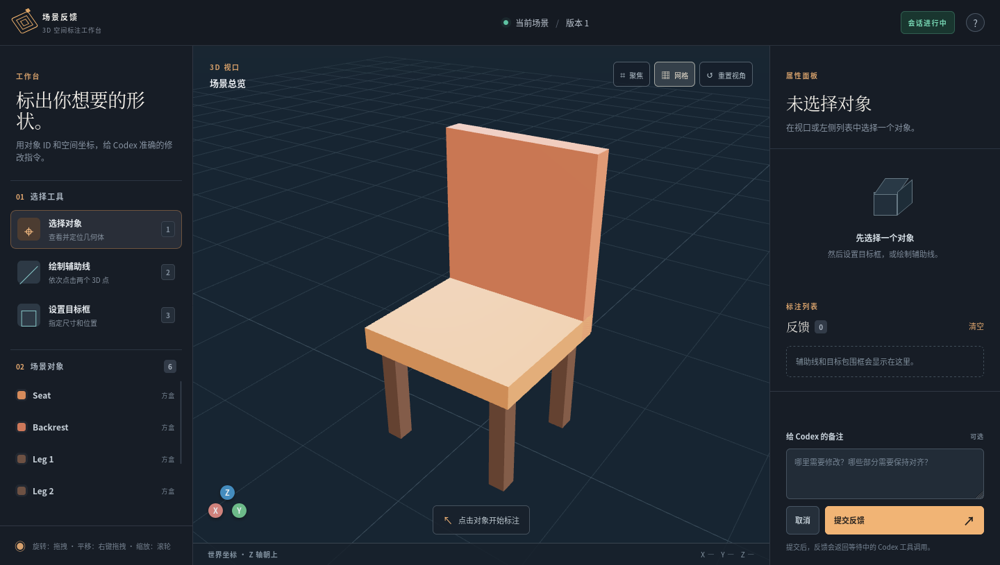

**语言 / Languages:** [简体中文](README.md) · [English](README.en.md) · [日本語](README.ja.md) · [한국어](README.ko.md) · **Русский**

# Рабочая область визуальной реконструкции Codex

В обычном режиме сделайте пометки на исходном изображении и текущей 3D-сцене, напишите короткое сообщение и нажмите «Отправить». Рабочая область передаст текст, исходные изображения, изображения с пометками и снимок сцены как **сообщение пользователя в том же диалоге Codex, которым управляет рабочая область**. Когда Codex изменит проект и опубликует GLB, результат появится на этой странице. Запускать в терминале отдельную команду для чтения обратной связи не нужно. Уже открытая задача Codex Desktop может использовать тот же интерфейс проверки через внешний режим MCP, описанный ниже.



## Как это работает

```text
Браузер: исходное изображение + 3D-сцена + пометки + текст
                 │ пользователь нажимает «Отправить»
                 ▼
          локальный Workspace Gateway
                 │ реальные изображения и события выполнения
                 ▼
       Codex App Server: тот же проект, тот же диалог
                 │ изменение исходных файлов, экспорт GLB, вызов MCP-инструментов
                 ▼
              обновление сцены в рабочей области
```

В обычном режиме Gateway сохраняет постоянный диалог Codex для этого проекта. Он запускает `codex app-server` через stdio и отправляет изображения как входные элементы `localImage`. Этот режим не внедряет сообщения в другие, уже открытые диалоги Codex на рабочем столе или в терминале. MCP служит для чтения контекста, запроса проверки у пользователя и публикации сцены; **кнопка отправки на веб-странице непосредственно запускает пользовательский ход**.

Интерфейс помогает человеку указать на проблему, но не задаёт алгоритм реконструкции и не требует вводить координаты или геометрические ограничения. Codex может использовать уже имеющиеся в проекте средства моделирования, реконструкции и редактирования.

## Возможности страницы

- Слева переключайте, масштабируйте и перемещайте исходные изображения. Справа вращайте и масштабируйте GLB-сцену и выбирайте её узлы.
- На обеих сторонах можно ставить точки, рисовать прямоугольники, линии, стрелки, произвольные штрихи и текст. Соответствующим друг другу пометкам можно присвоить номера; отсутствующий объект достаточно обвести только на исходном изображении.
- После нажатия «Разметить текущий ракурс» пометки на сцене привязываются к **снимку экрана, камере, выбранному объекту и версии сцены на тот момент**. Поворот живого 3D-вида не перенесёт старые пометки на другой объект; публикация новой сцены также не заменит снимок, на котором вы сейчас делаете пометки.
- При отправке сохраняется неизменяемый пакет обратной связи: исходный текст пользователя, исходные изображения и их версии с пометками, чистый и размеченный снимки сцены, выбранные узлы, камера и версия сцены. Пометки отражают подсказки человека, а исходные изображения хранятся отдельно.
- Новая обратная связь во время выполнения задачи попадает в очередь на следующий ход. Если пока она находилась в очереди сцена изменилась, страница сначала попросит подтвердить отправку обратной связи, основанной на старой версии. Запросы на одобрение действий и остановка также обрабатываются на странице. После обновления страницы проект, диалог и черновик сохраняются.

Сейчас для сцены принимается самодостаточный файл `.glb`. При публикации проверяется, что геометрия и ресурсы текстур встроены в BIN-блок GLB. И внешние URI, и data URI отклоняются: хотя data URI тоже может быть самодостаточным, в этой версии разрешён только BIN-блок. Можно отправить только исходное изображение и начать работу без начальной сцены.

## Совмещение с камерой исходного изображения

При выборе изображения с данными камеры 3D-вид автоматически переходит в точку съёмки. После ручного поворота нажмите `对齐参考视角` («Совместить с исходным ракурсом»), чтобы вернуться к этому виду, затем сравните контуры в режиме наложения. Если приложена копия с исправленной дисторсией, для наложения используется она: её проекция соответствует камере-обскуре. Исходный снимок хранится отдельно для просмотра и обратной связи. Изображения без калибровки по-прежнему можно сравнивать вручную. Приближённые внутренние параметры камеры могут оставить небольшое расхождение по краям изображения.

Для каждой камеры сохраняются `camera_to_world` (матрица 4×4 с порядком строк в системе координат GLB) и `intrinsics` в пикселях изображения (`width`, `height`, `fx`, `fy`, `cx`, `cy`). Для существующего изображения передайте `reference_id`, `camera` и, если нужно, `alignment_image_data_url` с исправленной дисторсией в защищённый API `POST /api/workspace/reference-cameras`. Файл `reference_cameras.json` в приватном каталоге данных сопоставляет камеры по префиксу имени при будущих импортах ([пример](examples/reference_cameras.example.json)); отправьте `{"apply_manifest":true}` в тот же API, чтобы применить его к уже добавленным изображениям. Положение камер и GLB должны быть заданы в одной мировой системе координат.

## Быстрый запуск: комната и шкаф

Сейчас подписи кнопок в браузере показаны на китайском языке: `标注当前视角` означает «Разметить текущий ракурс», а `发送到 Codex` — «Отправить Codex».

Потребуются Python 3.11+, браузер с поддержкой WebGL и выполненный вход в **`codex-cli 0.156.1`**. Форматы запросов и ответов App Server сверены с JSON Schema, созданной этой версией. Другие версии выдадут явную ошибку вместо незаметного использования несовместимых полей.

В корне клонированного репозитория выполните:

```bash
python3 -m venv .venv
.venv/bin/python -m pip install -r backend/requirements.txt
codex --version
.venv/bin/python examples/room_demo/seed_demo.py
.venv/bin/python backend/server.py --project-dir "$PWD" --data-dir "$PWD/examples/room_demo/output/data"
```

Gateway автоматически настраивает эти пять MCP-инструментов `scene_feedback` в диалоге Codex данного проекта; вручную выполнять `codex mcp add` не требуется. Gateway передаёт этому диалогу порт, каталог данных и каталог проекта, чтобы настройки другого проекта или глобального MCP не направили его в чужую рабочую область.

Откройте <http://127.0.0.1:18765/>. Слева будет изображение желаемого результата, справа — начальная GLB-сцена комнаты. Выберите шкаф, укажите на изображении нужное место, напишите «Шкаф должен быть ближе к левой стене; поправь его по изображению слева» и нажмите «Отправить». Исходные параметры примера находятся в [`examples/room_demo/scene.json`](examples/room_demo/scene.json); [`build_scene.py`](examples/room_demo/build_scene.py) создаёт GLB на основе этих параметров. Результат появится на странице после вызова Codex инструмента `workspace_publish_scene`. `seed_demo.py` использует отдельную папку `examples/room_demo/output/data` и не перезаписывает данные обычной рабочей области.

Для собственного проекта можно использовать:

```bash
.venv/bin/python backend/server.py --project-dir "/absolute/path/to/your/project" --data-dir "/absolute/path/to/private/workspace-data"
```

Добавьте исходные изображения в браузере. Попросите Codex собрать или экспортировать самодостаточный GLB из исходных файлов проекта и опубликовать его через MCP. Каталог проекта и ID диалога сохраняются в каталоге данных, поэтому после перезапуска восстанавливается тот же диалог. Один каталог данных привязывается только к одному проекту и не переключается незаметно на другой.

## Проверка из уже открытой задачи Codex Desktop (внешний режим MCP)

Уже открытая задача Codex Desktop может получать обратную связь двумя способами. При использовании только `--external-review` она вызывает `request_visual_feedback`. По умолчанию инструмент ждёт отправки из браузера, **даже если на сервере нет графического рабочего стола и браузер нельзя открыть автоматически**. После нажатия «Отправить» текст и изображения возвращаются как результат MCP-инструмента в ожидающую исходную задачу. Если явно указать `wait_for_submit=False`, инструмент сразу вернёт URL, `session_id` и `next_cursor`; затем исходная задача должна вызвать `wait_visual_feedback(session_id, cursor=next_cursor)`. Если ожидающий вызов уже завершился или превысил время ожидания, отзыв сохранится, но не возобновит бездействующую задачу автоматически. Прочитайте его из исходной задачи или используйте привязку задачи ниже. `get_visual_feedback` позволяет повторно прочитать отправленный отзыв.

Сначала установите зависимости, указанные выше. В терминале задайте абсолютные пути, зарегистрируйте глобальный MCP-сервер и запустите отдельный сервис для проверки:

```bash
REPO=/absolute/path/to/scene_feedback_harness
PROJECT=/absolute/path/to/your/existing/project
DATA=/absolute/path/to/private/external-review-data
codex mcp add scene_feedback_external \
  --env SCENE_FEEDBACK_PORT=18768 \
  --env SCENE_FEEDBACK_DATA_DIR="$DATA" \
  --env SCENE_FEEDBACK_PROJECT_DIR="$PROJECT" \
  -- "$REPO/.venv/bin/python" "$REPO/backend/mcp_server.py"
"$REPO/.venv/bin/python" "$REPO/backend/server.py" \
  --project-dir "$PROJECT" --data-dir "$DATA" --port 18768 --external-review
```

В файле `~/.codex/config.toml`, в разделе `[mcp_servers.scene_feedback_external]`, созданном командой `codex mcp add`, установите `tool_timeout_sec = 900`. Для инструментов проверки используйте `timeout_sec` не больше значения по умолчанию 600, чтобы оставить время на передачу изображений. **Перезапустите Codex Desktop**, чтобы уже открытая задача обновила список MCP-инструментов. Затем в этой задаче напишите «进入人工调试模式» («перейди в режим проверки человеком») или прямо попросите вызвать `request_visual_feedback`, передав пути к исходным изображениям и текущему GLB внутри проекта (если начальной сцены нет, GLB можно опустить). Без привязки задачи кнопка отправки в браузере завершает ожидающий вызов MCP; если инструмент явно не ожидал, вызовите `wait_visual_feedback` отдельно.

`PROJECT` — корень реконструкции для проверки; исходные изображения и GLB должны находиться внутри него. Он может быть подкаталогом рабочего каталога задачи Codex. `DATA` — закрытый каталог данных, предназначенный только для этого проекта. В примере используются отдельные порт, каталог данных и имя MCP, чтобы не смешивать этот режим с обычным. Опубликованную сцену по-прежнему можно обновить на странице через `workspace_publish_scene`.

### Привязка к существующей задаче Codex Desktop для автоматического продолжения

Чтобы нажатие «Отправить» продолжало **уже открытую задачу Codex Desktop** без ожидающего вызова MCP, остановите указанный выше сервис и перезапустите его с тем же проектом и каталогом данных, добавив UUID этой задачи. `THREAD_ID` — ID задачи Codex Desktop, **не** `session_id` рабочей области:

```bash
THREAD_ID=your-existing-codex-task-uuid
"$REPO/.venv/bin/python" "$REPO/backend/server.py" \
  --project-dir "$PROJECT" --data-dir "$DATA" --port 18768 \
  --external-review --shared-thread-id "$THREAD_ID"
```

Рабочая область подключается к работающему **Codex Desktop App Server на том же компьютере от имени того же пользователя**. Каждая отправка создаёт новый пользовательский ход в существующей задаче, включая текст, исходные изображения, изображения с пометками и снимки сцены; новая задача не создаётся. Пока задача занята, отзывы стоят в очереди, а страница показывает состояния ожидания, выполнения и завершения. Если версия сцены изменилась, пока отзыв ждал, отправку старого отзыва нужно подтвердить. Запросы Codex на одобрение и взаимодействие выводятся в рабочей области; автоматического одобрения нет. Если из-за разрыва связи статус доставки неизвестен, перед повторной попыткой проверьте историю исходной задачи, чтобы избежать дублей. Этот режим использует `websocket-client`, устанавливаемый из `backend/requirements.txt`. После привязки `request_visual_feedback` открывает или обновляет рабочую область и возвращает URL; **ожидать результат MCP не нужно**.

## Открытие страницы с другого устройства в LAN

Сервис остаётся на компьютере, где хранятся проект и запущены Codex и MCP; на других устройствах нужен только браузер. Остановите прежний сервис на этом порту и используйте те же `REPO`, `PROJECT` и `DATA`, что выше. Замените IP в примере на доступный в LAN адрес IPv4 **компьютера с сервисом**:

```bash
LAN_IP=192.168.1.10
"$REPO/.venv/bin/python" "$REPO/backend/server.py" \
  --project-dir "$PROJECT" --data-dir "$DATA" --port 18768 --external-review \
  --listen-host 0.0.0.0 --public-base-url "http://$LAN_IP:18768"
```

При запуске сервис печатает полную ссылку с `access_token`; она также возвращается инструментами MCP `request_visual_feedback` / `workspace_open`. Откройте **всю ссылку** в браузере другого устройства. После проверки токен исчезнет из адресной строки, а доступ сохранится в cookie браузера. Одного адреса `http://$LAN_IP:18768/` недостаточно; не публикуйте ссылку доступа. В обычном режиме рабочей области можно добавить те же два параметра с прежними портом и каталогом данных, опустив `--external-review`. Для постоянной работы ту же команду можно запускать через пользовательский сервис systemd. По LAN доступны страница рабочей области и её защищённый API; Codex на компьютере с проектом по-прежнему вызывает MCP через `127.0.0.1`. Если страница не открывается, разрешите выбранный TCP-порт в брандмауэре хоста. Режим LAN с обычным HTTP предназначен для доверенной сети.

Для привязанной задачи Codex Desktop добавьте `--shared-thread-id "$THREAD_ID"` и в команду запуска через LAN. Браузер может работать на другом устройстве в LAN, но сервис подключения к Codex Desktop должен запускаться на компьютере исходной задачи от имени того же пользователя.

## MCP-инструменты

| Инструмент | Назначение |
| --- | --- |
| `workspace_open` | Возвращает адрес рабочей области этого проекта или открывает её |
| `workspace_get_context` | Читает текущие исходные изображения, версию сцены и контекст проекта |
| `workspace_get_feedback` | Читает отправленную обратную связь и сами изображения |
| `workspace_publish_scene` | Проверяет и публикует новый GLB, сверяет ожидаемую версию и уведомляет страницу об обновлении |
| `workspace_request_feedback` | Обычный режим: просит пользователя проверить область на странице и сразу возвращает управление; ответ становится следующим пользовательским сообщением |
| `request_visual_feedback` / `wait_visual_feedback` | Внешний режим MCP без привязки: ждут отправки и возвращают текст и изображения как результат инструмента. При привязке к задаче первый инструмент возвращает URL, а отправка запускает новый ход |
| `get_visual_feedback` | Внешний режим MCP: повторно читает отправленный визуальный отзыв |

[Skill для визуальной реконструкции](.agents/skills/visual-reconstruction-feedback/SKILL.md) в репозитории напоминает Codex различать исходные изображения и пометки, редактировать исходные файлы проекта и публиковать GLB, когда результат готов. Обычный режим отправляет новый ход напрямую. Внешний режим MCP без привязки возвращает отзыв через ожидающий вызов `request_visual_feedback` или `wait_visual_feedback`. Режим с привязкой к задаче Codex Desktop запускает новый ход после отправки из браузера.

## Проверка и ограничения

```bash
.venv/bin/python -m unittest discover -s backend/tests -v
```

Реальная интеграция с App Server проверена на двух разных локальных изображениях: Codex распознал красное изображение в первом ходе, а после закрытия и перезапуска stdio распознал синее во втором ходе **того же диалога**. История `thread/read` содержит элементы `localImage` из обоих ходов. Это подтверждает, что модель получила сами изображения, а не только пути к ним.

Реальный путь «браузер → Codex → MCP» также проверен в двух раундах с Selenium. В первом раунде пользователь нарисовал по одному пронумерованному прямоугольнику на исходном изображении и изображении сцены; ход App Server содержал пять элементов `localImage`. Codex изменил демонстрационный `scene.json`, создал GLB и дважды успешно вызвал `workspace_publish_scene` через MCP, настроенный для проекта. После одобрения пользователем на странице браузер автоматически обновил версию сцены с 2 до 3, а затем до 4; координата центра шкафа `x` стала равна `-0.8`. Во втором раунде пользователь добавил на исходном изображении линию и снова отправил отзыв. В том же диалоге Codex получил ещё пять `input_image` и ответил подтверждением. Файлы не изменялись, повторной публикации не было, итоговая версия сцены — 4.

По умолчанию сервис слушает только `127.0.0.1`. С указанными выше параметрами LAN для страницы требуются ссылка доступа и cookie, а для отправки — также браузерная capability. Для связи с локальным MCP Gateway ходам Codex с политикой `workspaceWrite` задаётся `networkAccess: true`. Запросы на одобрение действий решает пользователь на странице; рабочая область не одобряет их автоматически. Рабочие данные и результаты демонстрации не попадают в Git.

Код проекта распространяется по [лицензии MIT](LICENSE). Файлы Three.js в репозитории сохраняют свою [исходную лицензию MIT](web/vendor/three/LICENSE).
